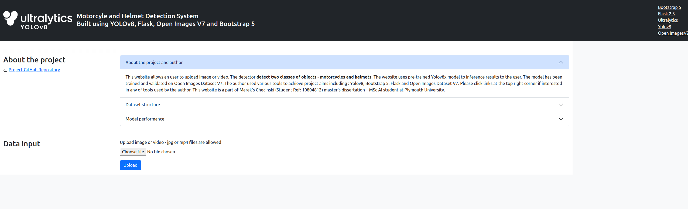

# Motorcycle and helmet detection end-user website
An end-user website runs trained by the author [YOLOv8](https://docs.ultralytics.com/) model to detect two types of objects: motorcycles and helmets.
There are two types of files allowed:
- images in ".jpg" format
- videos in ".mp4" format

The images used for the model training are corresponding classes of objects retrieved from [Open Images Datset V7](https://storage.googleapis.com/openimages/web/index.html) API. 
  

To run the web application follow these four steps: 
1. Clone repo
2. Download requirements file
```
python3 -m pip install -r .\requirements.txt
```
3. Run the web application
```
python3 .\webapp.py --port 5000 
```
4. Click and follow the link to 127.0.0.1:5000 to load website
# Example prediction

# Training Dataset
|Split|Value|Origin|Image size|
|:---:|:---:|:---:|:---:|
|Training|13499|Open Images Dataset V7|Various|
|Validation|417|Open Images Dataset V7|Various|
# Model Configuration
|Parameter|Value|
|:---:|:---:|
|Model|YOLOv8l|
|Epochs|100|
|Input image size (px)|640|
|Batch size|16|
|Cls loss|0.5|
|Box loss|7.5|
|DFL loss|1.5|
|IoU|0.7|

For more information please see configuration files: [config.yaml](config.yaml) and [args.yaml](args.yaml) 
# Accuracy
Results and accuracy: 
|Model|Epochs|Batch size|mAP@50|mAP@50-95|Precision|Recall|
|:---:|:---:|:---:|:---:|:---:|:---:|:---:|
|Yolov8l|100|16|0.792|0.562|0.753|0.772|

Accuracy per invidual class:
| Class       |  mAP@0.5 | 
| :---        | :---:    |    
| Motorcycle  | 0.842    |
| Helmet      | 0.742    | 
| Combined    | 0.792    |

# Precision-recall curve

# Confusion matrix 

